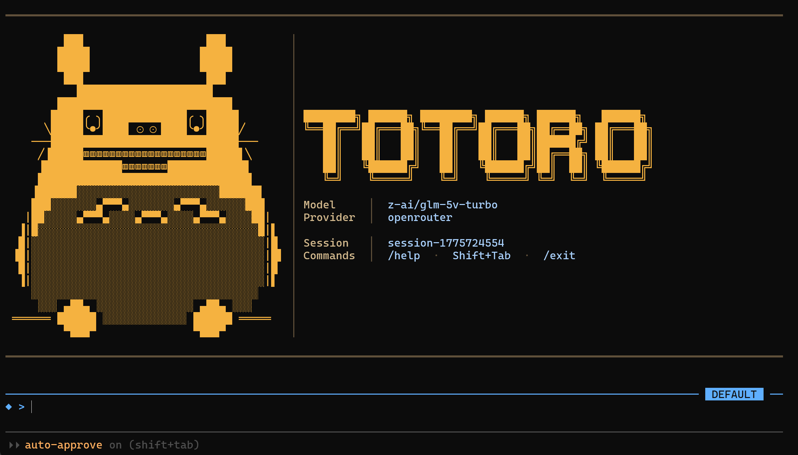

# Totoro: DeepAgents 프레임워크 기반의 터미널 자율 코딩 에이전트 CLI.



## 주요 기능

- **멀티 프로바이더** — OpenRouter, Anthropic, OpenAI, vLLM 지원 + 런타임 모델 전환
- **병렬 서브에이전트** — coder, explorer, researcher, reviewer, planner를 동시 실행
- **실시간 대시보드** — 서브에이전트 진행 상황, 플랜, 도구 호출을 라이브로 표시
- **세션 영구 저장** — SQLite 기반 체크포인터로 프로세스 재시작 후에도 세션 복원
- **인라인 자동완성** — `/` 입력 시 드롭다운 메뉴로 커맨드 선택 (prompt_toolkit)
- **HITL (Human-in-the-Loop)** — 위험한 도구 실행 전 승인/거부/수정 선택
- **Stall Detection** — 에이전트/서브에이전트가 멈추면 자동 감지 및 복구
- **Auto-Dream Memory** — 대화에서 중요한 정보를 자동 추출하여 장기 기억 저장
- **Git 안전 규칙** — force push, config 변경 등 위험 명령 자동 차단

## 설치

```bash
# 가상환경 활성화
source .venv/bin/activate

# 패키지 설치 (개발 모드)
pip install -e .
```

## 설정

`.env` 파일에 API 키를 설정합니다:

```env
# OpenRouter (권장 - 다양한 모델 지원)
OPENROUTER_API_KEY=sk-or-v1-...
OPENROUTER_BASE_URL=https://openrouter.ai/api/v1

# 또는 직접 Anthropic API
ANTHROPIC_API_KEY=sk-ant-...

# 또는 OpenAI
OPENAI_API_KEY=sk-...

# vLLM (셀프 호스팅)
VLLM_BASE_URL=http://localhost:8000/v1
VLLM_API_KEY=EMPTY

# 웹 검색 (선택)
TAVILY_API_KEY=tvly-...

# LangSmith 트레이싱 (선택)
LANGSMITH_API_KEY=lsv2_...
LANGSMITH_TRACING=true
LANGSMITH_PROJECT=TOTORO-CODE
```

API 키 우선순위: `OPENROUTER_API_KEY` > `ANTHROPIC_API_KEY` > `OPENAI_API_KEY` > `VLLM_BASE_URL`

## 실행 방법

### 대화형 모드 (기본)

```bash
totoro
```

터미널에서 에이전트와 대화하며 작업합니다. 도구 실행 시 승인을 요청합니다.

### 비대화형 모드

```bash
totoro -n "버그를 찾아서 수정해줘"
totoro -n "pyproject.toml을 읽고 의존성 목록을 알려줘"
```

### 위치 인수로 작업 전달

```bash
totoro fix the login bug
totoro "add error handling to the API endpoint"
```

## CLI 옵션

| 옵션 | 설명 |
|------|------|
| `-n TASK`, `--non-interactive TASK` | 비대화형 모드로 단일 작업 실행 |
| `--auto-approve` | 모든 도구 실행을 자동 승인 (HITL 비활성화) |
| `--model MODEL` | 사용할 모델 지정 |
| `--provider PROVIDER` | LLM 프로바이더 지정 (`auto`, `openrouter`, `anthropic`, `openai`, `vllm`) |
| `--resume SESSION_ID` | 이전 세션 이어서 작업 |
| `--list-sessions` | 저장된 세션 목록 표시 |
| `--verbose` | 도구 호출 및 결과를 상세히 표시 |

### 사용 예시

```bash
# 기본 대화형 모드
totoro

# 자동 승인으로 빠르게 작업
totoro --auto-approve -n "테스트 실행하고 결과 알려줘"

# 모델 + 프로바이더 지정
totoro --model Qwen/Qwen3-32B --provider vllm

# 이전 세션 이어서 작업
totoro --resume session-1234567890

# 저장된 세션 목록 보기
totoro --list-sessions
```

## 슬래시 커맨드

대화형 모드에서 `/`를 입력하면 자동완성 드롭다운이 표시됩니다.

| 커맨드 | 설명 |
|--------|------|
| `/help` | 사용 가능한 커맨드 목록 표시 |
| `/new [설명]` | 새 세션 시작 (예: `/new fix login bug`) |
| `/model [모델명] [프로바이더]` | 현재 모델 표시 또는 런타임 모델 전환 |
| `/mode` | 모드 순환 (default → auto-approve → plan-only) |
| `/session [번호\|ID]` | 현재 세션 정보 또는 세션 전환 |
| `/sessions` | 저장된 세션 목록 (번호로 전환 가능) |
| `/compact` | 컨텍스트 강제 압축 |
| `/memory` | 추출된 장기 기억 표시 |
| `/memory clear` | 모든 기억 삭제 |
| `/tasks` | 활성 서브에이전트 작업 표시 |
| `/status` | 에이전트 상태 (턴, 토큰, 메모리) |
| `/clear` | `/new`와 동일 |
| `/exit` | CLI 종료 |

### 모델 런타임 전환

세션 중에 모델을 변경할 수 있습니다:

```
◆ > /model anthropic/claude-sonnet-4-5
  Switching model: Qwen/Qwen3-32B → anthropic/claude-sonnet-4-5...
  Model switched to: anthropic/claude-sonnet-4-5 (provider: auto)

◆ > /model Qwen/Qwen3-32B vllm
  Switching model: anthropic/claude-sonnet-4-5 → Qwen/Qwen3-32B...
  Model switched to: Qwen/Qwen3-32B (provider: vllm)
```

### 세션 관리

세션 상태는 `~/.totoro/checkpoints.db` (SQLite)에 영구 저장됩니다.

```
◆ > /sessions
Sessions:  (use /session <number> to switch)
   1) session-1775543300  (3 turns, 1m ago) ◀ current
   2) session-1775542614  (12 turns, 15m ago) — fix login bug
   3) session-1775540000  (5 turns, 1h ago)

◆ > /session 2
Switched to session: session-1775542614 — fix login bug
  Turns: 12 · Messages: 34

◆ > /new implement search feature
New session: session-1775544000 — implement search feature
```

## 모드

`Shift+Tab` 또는 `/mode`로 순환합니다:

| 모드 | 아이콘 | 설명 |
|------|--------|------|
| default | ◆ | 위험한 도구 실행 시 승인 요청 |
| auto-approve | ⚡ | 모든 도구 실행 자동 승인 |
| plan-only | 📋 | 계획만 수립, 실행 안 함 |

## HITL (Human-in-the-Loop)

기본 모드에서 파일 쓰기, 셸 명령 등 실행 시 승인을 요청합니다:

```
[APPROVAL REQUIRED] execute
  command: npm install express
  (a)pprove / (r)eject / (e)dit ?
  >
```

- `a` 또는 Enter: 승인하고 실행
- `r`: 거부 (에이전트가 대안 모색)
- `e`: 인수를 자연어로 수정하여 실행 (LLM이 수정 적용)

## 병렬 서브에이전트

복잡한 작업은 여러 서브에이전트가 동시에 처리합니다:

| 타입 | 역할 |
|------|------|
| `coder` | 코드 작성, 파일 생성, 빌드/테스트 |
| `explorer` | 코드베이스 탐색, 구조 분석 (읽기 전용) |
| `researcher` | 웹 검색, 문서 조사 |
| `reviewer` | 코드 리뷰, 품질 분석 (읽기 전용) |
| `planner` | 복잡한 요청 분석, 계획 수립 |

실행 중 실시간 대시보드가 표시됩니다:

```
╭─ ◈ Totoro Status ───────────────────────────────────────╮
│ Executing  Plan: 2/5 · Tools: 12 · Agents: 3
├── Plan ────────────────────────────────────────────────┤
│  ████████░░░░░░░░░░░░ 40%
│  ✓ 프로젝트 구조 생성
│  ✓ 의존성 설치
│  ▸ 프론트엔드 구현
│  ○ 백엔드 구현
│  ○ 테스트 및 검증
├── Subagents (3 active) ────────────────────────────────┤
│  ◈ coder-0 (15s, 4 tools)
│    Create index.html with React setup
│    ⚡ write_file index.html
│  ◈ coder-1 (12s, 3 tools)
│    Create src/App.tsx component
│  ◈ coder-2 (8s, 2 tools)
│    Create api/handler.ts
├── Recent ──────────────────────────────────────────────┤
│  + coder-0: index.html
│  + coder-1: App.tsx
│  $ coder-2: npm install
╰────────────────────────────────────────────────────────╯
```

## 도구 (Tools)

### DeepAgents 내장 도구

| 도구 | 설명 |
|------|------|
| `read_file` | 파일 읽기 |
| `write_file` | 새 파일 작성 |
| `edit_file` | 파일 인라인 편집 (문자열 치환) |
| `glob` | 파일 패턴 매칭 |
| `grep` | 파일 내용 검색 |
| `ls` | 디렉토리 목록 |
| `write_todos` | 태스크 관리 (플랜 생성) |
| `execute` | 셸 명령 실행 |
| `task` | 단일 서브에이전트 위임 |
| `orchestrate_tool` | 병렬 서브에이전트 실행 |

### Totoro 커스텀 도구

| 도구 | 설명 |
|------|------|
| `git_tool` | Git 연산 (안전 규칙 내장) |
| `web_search_tool` | Tavily 웹 검색 |
| `fetch_url_tool` | URL 콘텐츠 가져오기 |
| `ask_user_tool` | 사용자에게 질문 |

## Git 안전 규칙

`git_tool`에는 안전 규칙이 내장되어 있습니다:

- `git config` 변경 차단
- `--no-verify` 사용 차단
- `main`/`master` 브랜치에 force push 차단
- 위험한 명령 (`push --force`, `reset --hard`, `rebase` 등)은 사용자 승인 필요
- 민감한 파일 (`.env`, `credentials` 등) 스테이징 시 경고

## 미들웨어 레이어

| 레이어 | 설명 |
|--------|------|
| `SanitizeMiddleware` | 서로게이트 문자 정리 (API 직렬화 오류 방지) |
| `StallDetectorMiddleware` | 에이전트 멈춤 감지 → 메시지 주입 → 모델 전환 → 사용자 질문 → 중단 |
| `AutoDreamMiddleware` | 대화에서 중요 정보 자동 추출하여 장기 기억 저장 |

## 설정 파일

설정은 5단계 우선순위로 적용됩니다:

1. CLI 인수 (최우선)
2. 환경변수 (`TOTORO_MODEL`, `TOTORO_FALLBACK_MODEL`, `TOTORO_SANDBOX_MODE`)
3. 프로젝트 설정 (`.totoro/settings.json`)
4. 사용자 전역 설정 (`~/.totoro/settings.json`)
5. 기본값

```json
// .totoro/settings.json (예시)
{
  "model": "anthropic/claude-sonnet-4-5",
  "provider": "openrouter",
  "permissions": {
    "mode": "default"
  },
  "memory": {
    "auto_extract": true
  },
  "loop": {
    "stall_detection": true
  }
}
```

## 데이터 저장 경로

| 경로 | 설명 |
|------|------|
| `~/.totoro/checkpoints.db` | 세션 대화 상태 (SQLite) |
| `~/.totoro/sessions.json` | 세션 메타데이터 (이름, 턴 수, 시간) |
| `~/.totoro/settings.json` | 사용자 전역 설정 |
| `.totoro/settings.json` | 프로젝트별 설정 |

## 아키텍처

```
totoro/
├── cli.py                # CLI 진입점 + 대화형 메인 루프 + 배너 (Totoro 마스코트)
├── colors.py             # 컬러 팔레트 (truecolor ANSI: Blue/Amber/Copper/Ivory)
├── input.py              # prompt_toolkit 기반 입력 (자동완성, 모드 전환)
├── hotkey.py             # 스트리밍 중 핫키 감지 (Shift+Tab)
├── diff.py               # 파일 변경 diff 포맷팅
├── orchestrator.py       # 병렬 서브에이전트 실행 엔진 (multiprocessing)
├── pane.py               # 서브에이전트 패널 상태 관리
├── status.py             # 실시간 대시보드 렌더러
├── tui.py                # curses 기반 split-pane TUI
├── skills.py             # 스킬 매니저 (CRUD + 원격 설치)
├── utils.py              # 텍스트 새니타이즈 유틸리티
├── commands/
│   └── registry.py       # 슬래시 커맨드 디스패치 (15개 커맨드)
├── config/
│   ├── schema.py         # Pydantic 설정 스키마 (AgentConfig)
│   ├── settings.py       # 5단계 설정 로더
│   └── setup.py          # 첫 실행 셋업 위저드
├── core/
│   ├── agent.py          # create_totoro_agent() — 에이전트 생성 + 미들웨어 조합
│   └── models.py         # LLM 프로바이더 초기화 (Auto-Dream용 경량 모델)
├── layers/
│   ├── sanitize.py       # surrogate 문자 정리 (API 호출 전)
│   ├── auto_dream.py     # 자동 기억 추출 미들웨어
│   ├── context_compaction.py  # 3단계 컨텍스트 컴팩션
│   └── stall_detector.py # 에이전트 멈춤 감지/복구
├── session/
│   ├── manager.py        # 세션 생성/전환/영구 저장 (SQLite)
│   └── restore.py        # 세션 복원 (--resume)
└── tools/
    ├── git.py            # Git 도구 (4단계 안전 규칙)
    ├── bash.py           # 셸 명령 실행
    ├── web_search.py     # Tavily 웹 검색
    ├── fetch_url.py      # URL 콘텐츠 가져오기
    └── ask_user.py       # 사용자 질문 (interrupt 기반 HITL)
```

## 개발

```bash
# 소스에서 실행
python -m totoro

# 또는 설치 후 실행
pip install -e .
totoro
```
